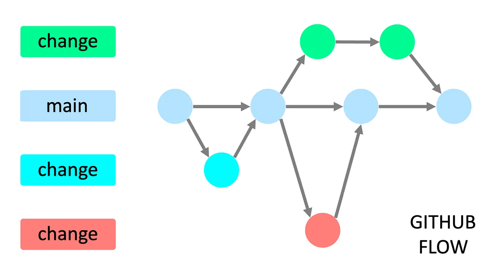

# Git Flow
---

Para este trabajo práctico utilizamos GitHub Flow como flujo de trabajo, ya que es ideal para equipos pequeños, facilita la iteración rápida y la entrega frecuente de cambios. Usamos la rama main como rama estable, mientras que, para agregar y probar nuevos cambios y nuevas funcionalidades creamos otras ramas que, posteriormente, al terminar la tarea, solicitamos realizar un *merge* a main a través de un Pull Request.

